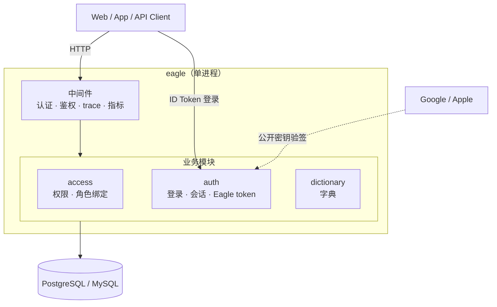

# eagle-go

基于 Kratos 的 Go 单体后端脚手架：一个进程、一个数据库、一个镜像，内置 Google/Apple 登录、
集中式 RBAC 和结构化日志 / 指标 / trace 埋点。适合作为新项目的起点，而不是一套需要先拆分才能用的微服务底座。

技术栈：Go 1.27、Kratos v3、Protobuf、buf、Ent、PostgreSQL / MySQL、Casbin、
go-oidc / go-jose、OpenTelemetry、Docker Compose。

## 项目现状

单进程单模块：一个根 `go.mod`、一个二进制 `eagle`、一个 PostgreSQL 或 MySQL 库、一个镜像。
业务能力按模块划分，模块只是包边界，不是部署边界。

| 模块 | 职责 | 分层 |
|---|---|---|
| `access` | 权限码目录、导航节点、角色权限绑定（Casbin） | `interfaces → application → domain ← infrastructure` |
| `auth` | Google/Apple 身份验证、本地会话与 Eagle token | `interfaces → application → domain ← infrastructure` |
| `dictionary` | 字典 CRUD，作为简单业务的样板 | `interfaces → domain ← infrastructure` |



Google/Apple 只证明第三方身份；Eagle 保存最小身份资料与可撤销会话，签发自己的 JWT，并通过
Casbin 判定角色权限。模块边界、数据所有权和
分层规则见[架构说明](docs/architecture.md)；启动与调试见[开发环境部署](docs/development-deployment.md)。

## 目录结构

```text
eagle-go/
├── api/eagle/<module>/v1/  # Protobuf 契约，HTTP 映射与权限注解的唯一来源
├── cmd/eagle/              # 进程入口与 显式组合根
├── configs/config.yaml     # 默认配置，生产由 EAGLE_* 环境变量覆盖
├── internal/
│   ├── access/             # 权限与角色绑定
│   ├── dictionary/         # 字典
│   └── platform/database/  # Ent Client 与 schema
├── migrations/             # goose SQL，生产不使用 Ent 自动迁移
├── pkg/                    # 无业务语义的技术能力，不得 import internal/
├── tests/                  # 架构测试、端到端测试和测试工具
├── tools/                  # 独立 go.mod，锁定生成工具链与迁移/健康检查程序
├── deploy/                 # 本地 Compose 与云效/ECS 应用部署资产
├── docs/                   # 架构与开发环境文档
├── Dockerfile              # 单一构建目标
└── Makefile                # 统一开发入口
```

模块内按用例复杂度渐进分层。简单 CRUD 使用：

```text
interfaces -> domain <- infrastructure
```

存在用例编排时使用：

```text
interfaces -> application -> domain <- infrastructure
```

| 层 | 职责 |
|---|---|
| `interfaces` | 入站接口层；实现生成的 Protobuf Service，转换协议对象并传递当前主体 |
| `application` | 可选；编排用例，只依赖本模块 `domain` |
| `domain` | 模型、不变量、领域错误和仓储/存储端口，不依赖框架 |
| `infrastructure` | 实现数据库和外部服务端口 |

只有真实不变量才需要聚合根。权限树适合领域模型；字典这类直接 CRUD 保持简单即可。
列表 API 统一使用 0-based `page`（`page=0` 为第一页），默认每页 20 条；领域查询的 offset
使用 `int64`，禁止在 `int32` 上先做页码乘法。

## 快速开始

### 1. 环境要求

- Go 1.27；较新的 Go 可按 `go.mod` 自动下载匹配工具链
- Docker Desktop 或兼容 Docker Compose 的运行环境
- Git、Make 和 Bash；Windows 建议使用 WSL 或 Git Bash

项目工具不要求全局安装。buf、goose、golangci-lint 和 Protobuf 插件的版本固定在
`tools/go.mod`，Makefile 会把它们编译到 `bin/` 后在仓库根目录执行——工具链版本被锁定，
但不会污染业务模块的依赖。

### 2. 验证工具并生成代码

```bash
make init
```

```bash
make generate
```

`make init` 会编译并验证锁定版本的开发工具。`make generate` 依次生成 API、配置和 Ent 代码，再整理依赖。生成文件已经提交到仓库；无源文件变更时，执行后 `git status` 不应
出现新的差异，CI 会检查这一点。

### 3. 启动完整本地环境

```bash
make up
```

```bash
docker compose -f deploy/docker-compose.yml ps --all
```

Compose 会构建镜像、执行一次性数据库迁移，再启动应用。
`eagle-migrate` 显示 `Exited (0)` 是一次性任务成功，不是重复服务或异常退出。主要入口：

| 入口 | 地址 |
|---|---|
| 应用 HTTP | `http://127.0.0.1:8000` |
| 应用 metrics / health | `http://127.0.0.1:9101` |

确认服务就绪：

```bash
curl --fail http://127.0.0.1:9101/readyz
```

停止环境并保留数据卷：

```bash
make down
```

### 4. 在宿主机调试

先启动基础依赖，再迁移并运行应用：

```bash
make up-deps
```

```bash
make migrate-up
```

```bash
make run
```

默认配置位于 `configs/config.yaml`，可用 `EAGLE_*` 环境变量覆盖。宿主机进程与 `eagle`
容器使用同一组端口，不能同时运行；完整的调试组合见[开发环境部署](docs/development-deployment.md)。

MySQL 宿主机调试使用同一组命令，显式选择驱动：

```bash
make up-deps EAGLE_DATABASE_DRIVER=mysql
make migrate-up EAGLE_DATABASE_DRIVER=mysql
make run EAGLE_DATABASE_DRIVER=mysql
```

### 5. 启用 Google/Apple 登录并调用接口

在 Google Cloud 或 Apple Developer 创建客户端，通过 `EAGLE_AUTH_GOOGLE_*` / `EAGLE_AUTH_APPLE_*`
启用对应方式。客户端 SDK 取得 ID Token 和登录 nonce 后调用 `/v1/auth/social/login`，响应中的
Eagle access token 用于受保护接口：

```bash
curl --fail -H "Authorization: Bearer $TOKEN" http://127.0.0.1:8000/v1/system/permissions
```

刷新与退出分别使用 `/v1/auth/token/refresh` 和 `/v1/auth/logout`。详细接入见
[Google/Apple 登录](docs/social-login.md)。

Eagle access token 使用非对称签名，验签公钥发布在 `/.well-known/jwks.json`。业务服务只需要
issuer、audience 和 JWKS，不应获得认证中心私钥。

## 常用命令

下面每个代码块只包含一个动作，IDEA/GoLand 启用 Markdown 和 Shell Script 插件后，可以点击
代码块左侧直接执行。

查看全部 Make 入口：

```bash
make help
```

验证锁定的开发工具：

```bash
make init
```

生成 API、配置、Ent 并整理依赖：

```bash
make generate
```

编译应用与迁移工具到 `bin/`：

```bash
make build
```

执行 Go 静态检查：

```bash
make lint
```

执行 race、覆盖率和集成测试：

```bash
make test
```

启动完整 Compose 环境：

```bash
make up
```

查看常驻容器和一次性任务：

```bash
docker compose -f deploy/docker-compose.yml ps --all
```

只启动宿主机调试所需的依赖：

```bash
make up-deps
```

在宿主机运行应用：

```bash
make run
```

停止 Compose 环境并保留数据卷：

```bash
make down
```

校验 Compose 文件能被正确解析：

```bash
make validate-deploy
```

`make test` 不需要 Docker。集成测试会用 embedded-postgres 启动真实 PostgreSQL；首次运行需要
联网下载约 100 MB 的数据库二进制，之后复用本地缓存。
真实 MySQL 迁移、仓储和 e2e 测试由 `make test-mysql` 运行，并通过
`EAGLE_TEST_MYSQL_DSN` 提供拥有创建临时数据库权限的账号。CI 会在真实 MySQL 服务上执行该目标。

跳过集成测试可使用：

```bash
go test -short ./...
```

## 开发指南

### 新增或修改 API

1. 在 `api/eagle/<module>/v1/*.proto` 修改契约。
2. 每个 RPC 显式声明 `access`；需要权限时同时声明三段式 `perm`。
3. 新权限码同时通过 `migrations/`（PostgreSQL）和 `migrations/mysql/` 下的 goose 迁移写入 `permission_definition`。
4. 执行 `make api`，不要手改 `*.pb.go`。
5. 按用例复杂度选择 `interfaces -> domain <- infrastructure` 或 `interfaces -> application -> domain <- infrastructure`。
6. 只有新增一个 Protobuf Service 时，才在 `cmd/eagle` 的 组合根 里注册。
7. 添加测试并执行 `make lint && make test`。

需要权限的 RPC 示例：

```protobuf
rpc CreatePermission(CreatePermissionRequest) returns (CreatePermissionResponse) {
  option (google.api.http) = {
    post: "/v1/system/permissions"
    body: "*"
  };
  option (eagle.annotations.v1.perm) = "system:permission:add";
  option (eagle.annotations.v1.access) = ACCESS_LEVEL_PERMISSION_REQUIRED;
}
```

访问级别有三种：

| `access` | 含义 | `perm` |
|---|---|---|
| `ACCESS_LEVEL_PUBLIC` | 无需登录 | 禁止填写 |
| `ACCESS_LEVEL_AUTHENTICATED` | 登录即可 | 禁止填写 |
| `ACCESS_LEVEL_PERMISSION_REQUIRED` | 登录且拥有指定权限 | 必须填写 |

遗漏 `access` 会在服务启动时失败。handler 中不再写鉴权 `if`，权限由中间件从方法描述符读取并统一判定。

### 权限码与角色授权

权限码使用 `领域:资源:动作` 三段格式，例如 `system:dict:add`。授给角色的通配只允许末段为 `*`，例如 `system:dict:*` 或 `system:*`；禁止 `system:*:add`。

权限分为两类数据：

- `permission_definition` 是后端契约目录；proto 使用的新权限码必须先进入这里。
- 导航节点用于菜单和按钮展示，只能引用已有权限码，不能创造权限。

角色由 Eagle token 携带，本库保存“角色可以做什么”。角色键是以字母开头、最多 64 字节的稳定键，
如 `user`、`admin`、`support-agent`。全量覆盖角色权限的示例：

```bash
curl -X PUT \
  -H "Authorization: Bearer $TOKEN" \
  -H "Content-Type: application/json" \
  -d '{"permission_codes":["system:dict:list"]}' \
  http://127.0.0.1:8000/v1/system/role-bindings/user
```

### 获取当前登录主体

需要审计人、所有者或租户锚点时，从 `context.Context` 获取中间件写入的主体：

```go
import "github.com/eagle-go/eagle/pkg/identity"

principal, ok := identity.FromContext(ctx)
subject := identity.Subject(ctx)
```

`Subject` 是 Eagle token 的 `sub`，是稳定字符串而非本地自增 ID。业务模块不要自行解析 JWT、
创建第二套 Principal，或根据 `principal.Roles` 重复鉴权。

### 新增业务模块或 CRUD

按以下顺序修改，避免协议、模型和数据库结构漂移：

1. 在 `internal/platform/database/ent/schema/` 定义表结构。
2. 执行 `make ent`，不要手改生成的 `ent/` 文件。
3. 同时在 `migrations/`（PostgreSQL）和 `migrations/mysql/` 添加等价的 goose SQL；生产不使用 Ent 自动迁移。
4. 在 `api/` 定义 RPC、校验规则、HTTP 映射和访问级别，然后执行 `make api`。
5. 在 `internal/<module>/domain` 放模型、规则和仓储/存储接口。
6. 仅在存在多端口、聚合变更、用例级事务编排、幂等、补偿或多入口复用时在 `application` 编排用例；纯 CRUD 由 `interfaces` 依赖 domain 端口。单个仓储操作内部使用事务不要求增加 application。`infrastructure` 实现数据库或外部服务端口，`interfaces` 只转换协议对象。
7. 在 `cmd/eagle` 的 `composeApp` 装配新模块，并检查构造失败和退出时的资源清理。
8. 先测领域不变量，再测真实基础设施与 HTTP 链路。

跨模块用例在本模块 `domain` 声明所需能力，由本模块 `infrastructure` 适配到对方公开的
`domain` 端口或 `application` 用例；`application` 仍只依赖本模块 domain。禁止 import 别的模块的
`infrastructure` 或 `interfaces`。单体里没有网络边界拦着，这条约束靠架构测试保证——它是把
“以后可以拆出去”这件事留在桌面上的唯一成本。简单 CRUD 不必为了形式引入聚合根、工厂或 DTO 体系。

## 认证与授权约定

Google/Apple 负责证明“第三方账号是谁”，Eagle 将其映射为本地身份、维护可撤销会话并签发
自己的 access/refresh token；Casbin 继续负责“这个身份的角色能不能调用接口”。新身份默认是
`user`，不会根据客户端提交内容获得管理员权限。未来接入手机号登录时，实现 `auth` 的身份验证端口并复用同一会话和 token 流程。

权限策略存在数据库里，每个实例本地持有一份 Casbin 模型，靠版本号每 5 秒对账一次。
多副本部署时，改完角色绑定最坏要等一个对账周期才会全部生效。进程启动时会校验 proto 声明的
权限码与数据库 catalog 一致，不一致直接 fail closed——这要求**先跑迁移再发服务**。

授权失败遵循关闭原则：未认证返回 401，无权限返回 403，判定异常不会自动放行。
包括 `admin` 在内的所有角色都必须经过 Casbin；管理员的全量权限来自种子策略 `system:*`，没有代码短路。

不要使用 Casbin `keyMatch2` 匹配权限码：冒号分隔的权限会被误当成 URL 参数。项目使用受限的
末段通配，并由领域层与 Casbin 一致性测试锁定行为。

## 配置

本地配置在 `configs/config.yaml`。生产通过环境变量和 Secret 覆盖，不直接修改镜像内文件。
配置在启动时校验，缺失或非法直接拒绝启动。常用覆盖项：

| 环境变量 | 用途 |
|---|---|
| `EAGLE_DATABASE_DRIVER` | `postgres` 或 `mysql`，默认 `postgres` |
| `EAGLE_DATABASE_DSN` | 数据库连接；PostgreSQL 生产启用 TLS，MySQL 必须包含 `parseTime=true` 并配置 TLS |
| `EAGLE_AUTH_ISSUER` | 必须与 token 的 `iss` 完全一致 |
| `EAGLE_AUTH_AUDIENCE` | Eagle access token 的必填 audience |
| `EAGLE_AUTH_SIGNING_KEY_DIRECTORY` | 容器内 JWT 密钥环目录；文件名 `<kid>.pem`，生产从 Secret 只读挂载 |
| `EAGLE_AUTH_ACTIVE_SIGNING_KEY_ID` | 当前签发密钥 ID，对应密钥环中的文件名（不含 `.pem`） |
| `EAGLE_AUTH_ACCESS_TOKEN_TTL` / `EAGLE_AUTH_REFRESH_TOKEN_TTL` | access/refresh token 有效期 |
| `EAGLE_AUTH_GOOGLE_ENABLED` / `EAGLE_AUTH_GOOGLE_CLIENT_ID` | 启用 Google 登录及其 OAuth Client ID |
| `EAGLE_AUTH_APPLE_ENABLED` / `EAGLE_AUTH_APPLE_CLIENT_ID` | 启用 Apple 登录及其 Services ID / Bundle ID |
| `EAGLE_OBSERVABILITY_OTLP_ENDPOINT` | trace 上报地址，留空则不上报 |

所有 `google.protobuf.Duration` 只接受秒格式，例如 `3600s`、`0.5s`。`1h`、`30m`、`500ms` 会导致配置解析失败。

## 构建与部署

本地编译：

```bash
make build
```

镜像采用多阶段构建：Go builder 编译，运行阶段使用 distroless。一个镜像同时包含常驻服务
`/app/eagle`、一次性迁移任务 `/app/migrate` 和健康探针 `/app/healthcheck`，三者同版本，
不会出现“服务已升级、迁移还没跑”的窗口。

```bash
make image VERSION=v1.2.0 REGISTRY=registry.example.com/eagle
```

```bash
make push-image VERSION=v1.2.0 REGISTRY=registry.example.com/eagle
```

仓库提供本地 Docker Compose，以及不包含数据库的 ECS 应用部署清单。远端按
「独立数据库 → 一次性迁移任务 → 服务更新 → readiness 观察」推进，应用容器启动时不自动迁移。
使用云效 Flow 部署开发、测试环境时，参见
[云效 Flow 开发与测试环境部署](docs/aliyun-flow-deployment.md)。

多副本部署时有两点要知道：权限策略每 5 秒按版本号对账，正常情况下改完角色绑定约一个周期后在
所有副本生效；进程启动时校验 proto 声明的权限码与数据库 catalog 一致，不一致直接 fail
closed，所以**必须先跑迁移再发服务**。

## 可观测性

应用输出结构化 JSON 日志到 stdout；宿主机的指标和健康检查默认在独立的 `9101`
端口上（容器内为 `9100`），不经过鉴权：
`/metrics` 供 Prometheus 抓取，`/livez` 只看进程存活，`/readyz` 聚合初始化状态、数据库和
策略加载检查。trace 通过 OTLP gRPC 上报，默认关闭；设置
`EAGLE_OBSERVABILITY_OTLP_ENDPOINT=host:4317` 即可接入任意 collector，collector 不可达只会在
后台重试，不影响启动。生产应按容量把 `trace_sample_ratio` 从开发期的 `1.0` 调低。

## 常见问题

### 服务启动时提示 duration 无效

检查所有时长是否使用 `5s`、`0.5s` 这类秒格式，不要写 `1h`、`30m` 或 `500ms`。

### 接口始终返回 401

检查 `EAGLE_AUTH_ISSUER` 和 `EAGLE_AUTH_AUDIENCE` 是否与 Eagle token 完全一致，再确认签发端与
验证端能从 issuer 的 `/.well-known/jwks.json` 取得 token `kid` 对应的公钥。认证中心私钥不能复制到
业务服务。

### 接口始终返回 403

确认 Eagle token 中包含预期的普通角色键，并检查该角色是否绑定了 RPC 声明的权限码；刚改完
绑定还需要等一个 5 秒对账周期。不要在 handler 临时绕过鉴权。

### 修改 proto 或 Ent schema 后行为不一致

执行 `make api` 或 `make ent`，完整场景直接执行 `make generate`。生成文件禁止
手改，CI 会检查生成结果和源定义是否一致。

### Windows 上 `go test -race` 报 cgo 错误

race detector 需要 C 编译器。可在 WSL/Linux 中运行，或安装可用的 C 工具链；CI 会在 Linux 上
执行完整 `make test`。

## 文档与约束

- [架构说明](docs/architecture.md)：模块边界、分层、数据所有权和共享代码边界
- [开发环境部署](docs/development-deployment.md)：Compose、宿主机调试、IDEA 入口和本地联调
- [部署文件索引](deploy/README.md)：本地 Compose 的内容
- [AI 编码约束](AGENTS.md)：常驻硬约束；细则在 [`.agents/rules/`](.agents/rules/)

规则文件服务于 AI 协作，不替代面向开发者的 README 和专题文档。
