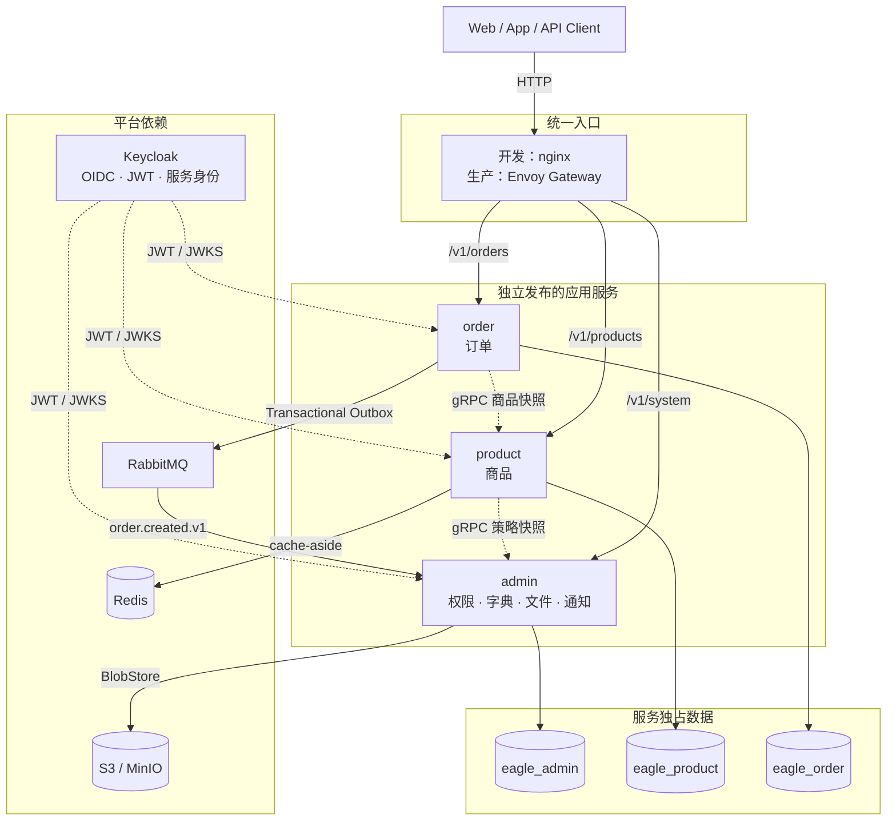

# eagle-go

基于 Go Workspace 的 Kratos 微服务开发底座，提供 OIDC 认证、集中 RBAC、服务间认证、缓存、可靠事件、对象存储与完整可观测性，并用商品、订单演示服务独立数据库、同步调用和异步事件。

技术栈：Go 1.27、Kratos v3、Google Wire、Protobuf、buf、Ent、PostgreSQL 17、Keycloak、Casbin、Redis、RabbitMQ、S3、OpenTelemetry、Prometheus、Loki、Tempo、Grafana、Kubernetes Gateway API。

## 项目现状

仓库包含三个独立进程，而不是一个打包所有模块的单体：

| 服务 | 业务能力 | 数据库 | 依赖 |
|---|---|---|---|
| `admin` | 权限、字典、文件、站内通知 | `eagle_admin` | Keycloak、S3、RabbitMQ |
| `product` | 商品 | `eagle_product` | admin 策略快照、Redis |
| `order` | 订单和商品快照 | `eagle_order` | product 商品查询、RabbitMQ |

每个服务都有自己的 `go.mod`、配置、Ent Client、迁移、二进制和镜像。根目录的 `go.work` 只负责把这些模块组合成本地开发工作区，不集中管理各服务依赖。



更完整的服务边界、分层和数据所有权见[架构说明](docs/architecture.md)。启动和调试见
[开发环境部署](docs/development-deployment.md)，镜像与 Kubernetes 发布见
[生产环境部署](docs/deployment.md)。

## 目录结构

```text
eagle-go/
├── api/                    # 跨服务 Protobuf 契约，独立 Go module
├── app/
│   ├── admin/              # 服务入口、模块、配置、Ent、迁移和测试
│   ├── product/
│   └── order/
├── pkg/                    # 无业务语义的共享技术能力，独立 Go module
├── deploy/                 # Compose、网关、Keycloak、可观测性
├── tools/                  # 固定版本的生成工具、迁移与健康检查程序
├── tests/                  # 架构测试和跨模块测试工具
├── docs/                   # 架构与部署专题文档
├── go.work                 # 本地组合各 Go module
├── Dockerfile              # 按 SERVICE 构建单服务镜像
└── Makefile                # 统一开发入口
```

业务代码先按服务、再按模块组织。简单 CRUD 使用：

```text
service -> domain <- infrastructure
```

存在用例编排时使用：

```text
service -> application -> domain <- infrastructure
```

| 层 | 职责 |
|---|---|
| `service` | 实现生成的 Protobuf Service，转换协议对象并传递当前主体 |
| `application` | 可选；编排用例，只依赖本模块 `domain` |
| `domain` | 模型、不变量、领域错误和仓储/客户端端口，不依赖框架 |
| `infrastructure` | 实现数据库、文件存储和跨服务客户端端口 |

只有真实不变量才需要聚合根。权限树、订单适合领域模型；字典这类直接 CRUD 保持简单即可。
列表 API 统一使用 0-based `page`（`page=0` 为第一页），默认每页 20 条；领域查询的 offset
使用 `int64`，禁止在 `int32` 上先做页码乘法。

## 快速开始

### 1. 环境要求

- Go 1.27；较新的 Go 可按 `go.mod` 自动下载匹配工具链
- Docker Desktop 或兼容 Docker Compose 的运行环境
- Git、Make 和 Bash；Windows 建议使用 WSL 或 Git Bash

项目工具不要求全局安装。buf、goose、golangci-lint 和 Protobuf 插件都固定在 `tools/go.mod`，Makefile 通过 `go tool` 调用。

### 2. 验证工具并生成代码

```bash
make init
```

```bash
make generate
```

`make init` 会下载并验证锁定版本的开发工具。`make generate` 依次生成 API、配置、各服务 Ent 和组合根 Wire 代码，再整理所有模块依赖。生成文件已经提交到仓库；无源文件变更时，执行后 `git status` 不应出现新的差异。

### 3. 启动完整本地环境

```bash
make up
```

```bash
docker compose -f deploy/docker-compose.yml ps --all
```

Compose 会构建三个独立服务镜像，依次完成各自数据库迁移，再启动服务和 nginx 开发网关。
`*-migrate` 显示 `Exited (0)` 是一次性任务成功，不是重复服务或异常退出。主要入口：

| 入口 | 地址 |
|---|---|
| 统一 HTTP 网关 | `http://127.0.0.1:8000` |
| Keycloak | `http://127.0.0.1:8080` |
| Keycloak 管理员 | 本地开发账号 `admin/admin` |
| RabbitMQ 管理台 | `http://127.0.0.1:15672`，本地账号 `eagle/eagle` |
| MinIO Console | `http://127.0.0.1:9005`，本地账号 `eagle/eagle-local-secret` |
| admin metrics/health | `http://127.0.0.1:9101` |
| product metrics/health | `http://127.0.0.1:9102` |
| order metrics/health | `http://127.0.0.1:9103` |

确认服务就绪：

```bash
curl --fail http://127.0.0.1:9101/readyz
```

```bash
curl --fail http://127.0.0.1:9102/readyz
```

```bash
curl --fail http://127.0.0.1:9103/readyz
```

停止环境：

```bash
make down
```

### 4. 只在宿主机调试一个服务

先启动 PostgreSQL 和 Keycloak，再迁移并运行目标服务：

```bash
make up-deps
```

```bash
make migrate-up SERVICE=admin
```

```bash
make run SERVICE=admin
```

`product` 依赖 admin，`order` 依赖 product。调试这两个服务时，需要同时保证它们的上游已启动。
默认配置分别位于 `app/<service>/configs/config.yaml`，也可用环境变量覆盖。完整的宿主机调试组合见
[开发环境部署](docs/development-deployment.md)。

### 5. 创建首个用户并调用接口

`realm-eagle.json` 刻意不预置用户，避免已知口令随配置进入生产。先登录 Keycloak 管理 CLI：

```bash
docker compose -f deploy/docker-compose.yml exec -T keycloak /opt/keycloak/bin/kcadm.sh config credentials --server http://localhost:8080 --realm master --user admin --password admin
```

创建用户时必须填写姓名，否则 Keycloak 26 的资料校验会阻止登录：

```bash
docker compose -f deploy/docker-compose.yml exec -T keycloak /opt/keycloak/bin/kcadm.sh create users -r eagle -s username=alice -s enabled=true -s firstName=Alice -s lastName=Test -s email=alice@example.com
```

```bash
docker compose -f deploy/docker-compose.yml exec -T keycloak /opt/keycloak/bin/kcadm.sh set-password -r eagle --username alice --new-password 'Passw0rd!'
```

```bash
docker compose -f deploy/docker-compose.yml exec -T keycloak /opt/keycloak/bin/kcadm.sh add-roles -r eagle --uusername alice --rolename admin
```

取得 token 并通过网关调用受保护接口。这里保留为一个原子命令，确保从 IDEA 运行代码块时
shell 变量不会在两个进程之间丢失：

```bash
TOKEN=$(curl --silent --fail -d client_id=eagle-web -d username=alice -d 'password=Passw0rd!' -d grant_type=password http://127.0.0.1:8080/realms/eagle/protocol/openid-connect/token | sed -n 's/.*"access_token":"\([^"]*\)".*/\1/p') && curl --fail -H "Authorization: Bearer $TOKEN" http://127.0.0.1:8000/v1/system/permissions
```

不带 `Authorization` 应返回 401。Keycloak realm 的完整设计和生产注意事项见 [Keycloak 配置说明](deploy/keycloak/README.md)。

## 常用命令

下面每个代码块只包含一个动作，IDEA/GoLand 启用 Markdown 和 Shell Script 插件后，可以点击
代码块左侧直接执行。

查看全部 Make 入口：

```bash
make help
```

验证锁定的开发工具：

```bash
make init
```

生成 API、配置、Ent、Wire 并整理依赖：

```bash
make generate
```

编译全部服务和运维工具：

```bash
make build
```

执行 Go 静态检查：

```bash
make lint
```

执行 race、覆盖率和集成测试：

```bash
make test
```

启动完整 Compose 环境：

```bash
make up
```

查看常驻容器和一次性任务：

```bash
docker compose -f deploy/docker-compose.yml ps --all
```

只启动宿主机调试所需的依赖：

```bash
make up-deps
```

停止 Compose 环境并保留数据卷：

```bash
make down
```

运行 admin：

```bash
make run SERVICE=admin
```

运行 product：

```bash
make run SERVICE=product
```

运行 order：

```bash
make run SERVICE=order
```

校验 Compose、迁移模板和 Kustomize 清单：

```bash
make validate-deploy
```

`make test` 不需要 Docker。集成测试会用 embedded-postgres 启动真实 PostgreSQL；首次运行需要联网下载约 100 MB 的数据库二进制，之后复用本地缓存。

跳过集成测试可使用：

```bash
go test -short ./app/admin/... ./app/product/... ./app/order/... ./pkg/...
```

## 开发指南

### 新增或修改 API

1. 在 `api/eagle/<module>/v1/*.proto` 修改契约。
2. 每个 RPC 显式声明 `access`；需要权限时同时声明三段式 `perm`。
3. 新权限码通过 admin 的 goose 迁移写入 `permission_definition`。
4. 执行 `make api`，不要手改 `*.pb.go`。
5. 按用例复杂度选择 `service -> domain <- infrastructure` 或 `service -> application -> domain <- infrastructure`。
6. 只有新增一个 Protobuf Service 时，才在 `app/<service>/cmd/<service>` 的 Wire provider 里注册。
7. 添加测试并执行 `make lint && make test`。

需要权限的 RPC 示例：

```protobuf
rpc CreatePermission(CreatePermissionRequest) returns (CreatePermissionResponse) {
  option (google.api.http) = {
    post: "/v1/system/permissions"
    body: "*"
  };
  option (eagle.annotations.v1.perm) = "system:permission:add";
  option (eagle.annotations.v1.access) = ACCESS_LEVEL_PERMISSION_REQUIRED;
}
```

访问级别有四种：

| `access` | 含义 | `perm` |
|---|---|---|
| `ACCESS_LEVEL_PUBLIC` | 无需登录 | 禁止填写 |
| `ACCESS_LEVEL_AUTHENTICATED` | 登录即可 | 禁止填写 |
| `ACCESS_LEVEL_PERMISSION_REQUIRED` | 登录且拥有指定权限 | 必须填写 |
| `ACCESS_LEVEL_INTERNAL` | 仅允许白名单中的服务身份 | 禁止填写 |

遗漏 `access` 会在服务启动时失败。handler 中不再写鉴权 `if`，权限由中间件从方法描述符读取并统一判定。

### 权限码与角色授权

权限码使用 `领域:资源:动作` 三段格式，例如 `system:dict:add`。授给角色的通配只允许末段为 `*`，例如 `system:dict:*` 或 `system:*`；禁止 `system:*:add`。

权限分为两类数据：

- `permission_definition` 是后端契约目录；proto 使用的新权限码必须先进入这里。
- 导航节点用于菜单和按钮展示，只能引用已有权限码，不能创造权限。

角色来自 Keycloak，本库只保存“角色可以做什么”。角色键必须保留来源：`realm:<role>` 或 `client:<client-id>:<role>`。全量覆盖角色权限的示例：

```bash
curl -X PUT \
  -H "Authorization: Bearer $TOKEN" \
  -H "Content-Type: application/json" \
  -d '{"permission_codes":["system:dict:query","system:dict:list"]}' \
  http://127.0.0.1:8000/v1/system/role-bindings/realm:user
```

### 获取当前登录主体

需要审计人、所有者或租户锚点时，从 `context.Context` 获取中间件写入的主体：

```go
import "github.com/eagle-go/eagle/pkg/identity"

principal, ok := identity.FromContext(ctx)
subject := identity.Subject(ctx)
```

`Subject` 是 Keycloak token 的 `sub`，是字符串而非本地自增用户 ID。不要在本项目新建用户表，也不要根据 `principal.Roles` 在业务代码里重复鉴权。

### 新增业务模块或 CRUD

按以下顺序修改，避免协议、模型和数据库结构漂移：

1. 在目标服务 `internal/platform/database/ent/schema/` 定义表结构。
2. 执行 `make ent`，不要手改生成的 `ent/` 文件。
3. 在 `app/<service>/migrations/` 添加 goose SQL；生产不使用 Ent 自动迁移。
4. 在 `api/` 定义 RPC、校验规则、HTTP 映射和访问级别，然后执行 `make api`。
5. 在 `internal/<module>/domain` 放模型、规则和仓储/客户端接口。
6. 仅在存在多端口、聚合变更、事务、幂等、补偿或多入口复用时在 `application` 编排用例；纯 CRUD 由 `service` 依赖 domain 端口。`infrastructure` 实现数据库或远程端口，`service` 只转换协议对象。
7. 在 `app/<service>/cmd/<service>` 的 `providerSet` 装配新模块，然后执行 `make wire`。禁止手改 `wire_gen.go`。
8. 先测领域不变量，再测真实基础设施与 HTTP 链路。

跨服务调用只能依赖 `api` 契约：禁止 import 其他服务实现、读取对方表、建立跨库外键或跨服务事务。简单 CRUD 不必为了形式引入聚合根、工厂或 DTO 体系。

## 认证与授权约定

Keycloak 负责“你是谁、有哪些角色”，Casbin 负责“角色能不能调用接口”。所有服务本地验证 JWT；admin 维护权限策略并提供只读 gRPC 判定，product 不连接权限数据库。

服务间调用使用 Keycloak OAuth2 Client Credentials。调用方缓存短期 access token，公共客户端中间件负责注入 Bearer token；内部 RPC 只接受 `ACCESS_LEVEL_INTERNAL`，并校验 token 的服务身份及 `internal_client_ids` 白名单。开发用的 `eagle-worker` secret 只存在于本地配置，生产必须由 Secret Manager 注入并为每个调用方使用独立 client。

同步调用默认启用 tracing、客户端指标、metadata 传播和熔断。只有明确幂等的读请求才按配置做有限重试；写请求不能仅靠重试解决一致性。订单事件使用“数据库事务 + Outbox + RabbitMQ publisher confirm”，消费端用 Inbox 去重并在处理成功后 ack，提供至少一次投递语义。

授权失败遵循关闭原则：未认证返回 401，无权限返回 403，远程判定异常不会自动放行。`realm` 角色和各服务 `client` 角色具有独立命名空间，同名也不会串权。

不要使用 Casbin `keyMatch2` 匹配权限码：冒号分隔的权限会被误当成 URL 参数。项目使用受限的末段通配，并由领域层与 Casbin 一致性测试锁定行为。

## 配置

本地配置在 `app/<service>/configs/config.yaml`。生产通过环境变量、ConfigMap 和 Secret 覆盖，不直接修改镜像内文件。常用覆盖项包括：

| 环境变量 | 用途 |
|---|---|
| `EAGLE_DATABASE_DSN` | 当前服务独占数据库连接 |
| `EAGLE_AUTH_ISSUER` | 必须与 token 的 `iss` 完全一致 |
| `EAGLE_AUTH_CLIENT_ID` / `EAGLE_AUTH_AUDIENCE` | 当前资源服务 client 与 audience |
| `EAGLE_AUTH_INTERNAL_CLIENT_ID` | 允许调用当前服务内部 RPC 的 client |
| `EAGLE_AUTH_JWKS_URL` | issuer 外网地址与服务访问地址不同时指定 JWKS 内网地址 |
| `EAGLE_SERVICE_AUTH_TOKEN_URL` / `CLIENT_ID` / `CLIENT_SECRET` | 服务间 Client Credentials |
| `EAGLE_UPSTREAM_AUTHORIZATION_ENDPOINT` | product 到 admin 的 gRPC 地址 |
| `EAGLE_UPSTREAM_PRODUCT_ENDPOINT` | order 到 product 的 gRPC 地址 |
| `EAGLE_CACHE_REDIS_ADDRESS` / `PASSWORD` | product 商品缓存 |
| `EAGLE_MESSAGING_RABBITMQ_URL` | 订单事件发布与通知消费 |
| `EAGLE_FILE_PROVIDER` | `local` 或 `s3` |
| `EAGLE_FILE_S3_ENDPOINT` / `BUCKET` / `ACCESS_KEY` / `SECRET_KEY` | S3/OSS/MinIO 连接配置 |

所有 `google.protobuf.Duration` 只接受秒格式，例如 `3600s`、`0.5s`。`1h`、`30m`、`500ms` 会导致配置解析失败。

## 构建与部署

本地编译：

```bash
make build
```

镜像采用多阶段构建：在 Go builder 中编译指定服务，运行阶段使用 distroless。一个参数化 Dockerfile 会产出三个不同镜像，每个镜像只包含当前服务的二进制、配置和迁移，不会把全部服务塞进同一镜像。

```bash
make image SERVICE=product VERSION=v1.2.0 REGISTRY=registry.example.com/eagle
```

```bash
make images VERSION=v1.2.0 REGISTRY=registry.example.com/eagle
```

```bash
make push-images VERSION=v1.2.0 REGISTRY=registry.example.com/eagle
```

生产中每个服务使用独立 Deployment、Service、迁移 Job 和数据库账号。仓库提供 Gateway API、TLS 跳转、HPA、PDB、NetworkPolicy、探针和安全上下文基线；迁移成功后再滚动服务，应用容器启动时不自动迁移。详细发布顺序、端口、网络和存储边界见 [部署说明](docs/deployment.md)。

## 可观测性

服务输出结构化日志，trace 通过 OTLP 上报，指标和健康检查使用独立端口。启动 Prometheus、Alertmanager、Tempo、Loki、Alloy 和 Grafana：

```bash
docker compose -f deploy/docker-compose.yml --profile obs up -d
```

Grafana 位于 `http://127.0.0.1:3000`，Prometheus 位于 `http://127.0.0.1:9090`，Alertmanager 位于 `http://127.0.0.1:9093`。Alloy 收集 Compose 容器 stdout 到 Loki；Grafana 已配置 Prometheus、Loki 和 Tempo 数据源及日志到 trace 的关联。

默认 SLO 是 30 天 99.9% 可用性，并提供错误预算快速消耗、p99 超过 2 秒、RabbitMQ 队列积压和 Redis 不可用告警。示例 Alertmanager 不发送外部通知，生产 overlay 必须接入实际值班渠道。生产环境还应按容量将 `trace_sample_ratio` 从开发期的 `1.0` 调低。

## 常见问题

### 服务启动时提示 duration 无效

检查所有时长是否使用 `5s`、`0.5s` 这类秒格式，不要写 `1h`、`30m` 或 `500ms`。

### Keycloak 登录提示 `Account is not fully set up`

用户缺少 `firstName` 或 `lastName`。补齐资料后重新登录。

### 接口始终返回 401

检查 `EAGLE_AUTH_ISSUER` 是否与 token 的 `iss` 完全一致，包括协议、端口和尾部斜杠；再检查 audience 和 JWKS 地址。

### 接口始终返回 403

确认 token 中确实包含预期的 realm/client role，并检查该带命名空间的角色键是否绑定了 RPC 声明的权限码。不要在 handler 临时绕过鉴权。

### 修改 proto 或 Ent schema 后行为不一致

执行 `make api`、`make ent` 或 `make wire`，完整场景直接执行 `make generate`。生成文件禁止手改，CI 会检查生成结果和源定义是否一致。

### Windows 上 `go test -race` 报 cgo 错误

race detector 需要 C 编译器。可在 WSL/Linux 中运行，或安装可用的 C 工具链；CI 会在 Linux 上执行完整 `make test`。

## 文档与约束

- [架构说明](docs/architecture.md)：服务边界、分层、数据所有权和跨服务调用
- [开发环境部署](docs/development-deployment.md)：Compose、宿主机调试、IDEA 入口和本地联调
- [生产环境部署](docs/deployment.md)：不可变镜像、Kubernetes、迁移顺序、网关和上线检查
- [生产运行手册](docs/operations.md)：告警、MQ、备份恢复、回滚和故障处置
- [Kubernetes 基线](deploy/kubernetes/README.md)：Gateway API、Secret、发布与可观测性清单
- [Keycloak 配置说明](deploy/keycloak/README.md)：realm、安全设置和客户端设计
- [AI 编码约束](AGENTS.md)：常驻硬约束；细则在 [`.agents/rules/`](.agents/rules/)

规则文件服务于 AI 协作，不替代面向开发者的 README 和专题文档。
